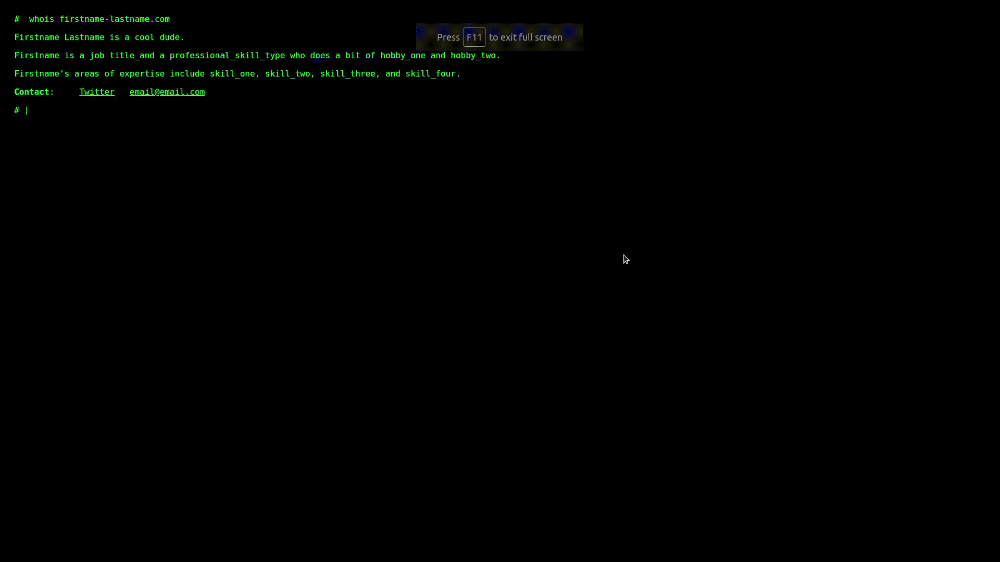

# business card terminal style website template

Replace the boilerplate text in the html file for your very own business-card style webpage that looks like a neat terminal, with all the text getting typed in.

Just grab the files in the `docs` folder, change the text between the `<noscript>` tags in the `index.htm` with your own stuff and load it up to your host of your own choice.  

- `functions.js`
- `index.htm`
- `style.css`

Easy site hosting recommendation: [Github Pages](https://pages.github.com/)

 
